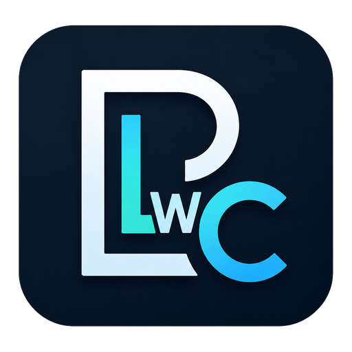

# PLwC — Personality Layer with Conscience

<p align="center">
  
</p>

PLwC is a local, model-independent governance gateway for AI tool access,
persistent context and controlled memory. It is not the agent and it is not the
language model. It is the independent control layer between the AI host, the
model and local tools.

```text
AI host / model
       |
       v
PLwC governance gateway
       |
       v
tools, files, profiles, memory and sandbox
```

PLwC exposes **one visible MCP server**, routes all capabilities through policy
and governance checks, and provides workspace, document, sandbox, profile,
reflection and audit-oriented controls. The gateway is designed for MCP-capable
hosts in general. Claude Desktop is the current primary packaged and
smoke-tested Open Beta route, but the boundary remains useful when a host, such
as ChatGPT Work, Claude or another MCP client, also offers its own file access
or agent features.

## Status

- Current status: **Open Beta**, based on `v0.2.0-rc18.dev9`.
- This repository is the privacy-filtered public Open Beta snapshot. Private
  development history, local evidence, real profiles and workspace data are
  intentionally not included.
- `v0.2.0-rc18.dev9` combines `PR-005` privacy-filtered packaging with
  `RC18-ALIAS-001`: reflection marker/trust inputs are English-first while
  preserving PBA2 canonical storage.
- Readiness audit result: **RC_READY_WITH_NOTES**.
- This is **not** a final public release.
- The latest package-, Desktop- and Odysseus-smoked open beta package is
  `v0.2.0-rc18.dev9` with verdict `PASS`.
- The packaged MCPB is **not signed**.

PLwC is not production-certified. It is local infrastructure under
active development.

## What PLwC is - and what it is not

PLwC is:

- an MCP gateway, not its own agent;
- a local governance boundary between model requests and tool execution;
- model- and host-independent policy for MCP-capable hosts;
- controlled memory, profile and persona management through explicit profile,
  reflection and Governor flows;
- a single public MCP boundary named `plwc-gateway`.

PLwC is not:

- a standalone AI platform;
- a desktop agent;
- the language model or a replacement for the user's chosen AI host;
- a full proxy for all model traffic;
- protection for data that a user or host sends directly to a cloud model
  outside PLwC;
- permission to expose raw PLfC/PBA or Desktop Commander MCP servers beside the
  gateway.

## What PLwC does

- Exposes exactly **one** visible MCP server: `plwc-gateway`.
- Provides exactly **eight** public facade tools (see below).
- Controls workspace operations (read / write / search / move / rename
  / exact replace / batch read).
- Creates and reads `DOCX`, `XLSX`, `PPTX` and `PDF` artifacts.
- Inspects, extracts, merges, splits and rotates PDFs.
- Inspects, extracts and creates ZIP archives with bounded safety
  limits.
- Reads workspace raster images and returns them as MCP image content
  blocks (PNG, JPEG, WEBP, first-frame GIF).
- Runs sandboxed Python and Shell snippets through Docker, with no
  silent fallback to a host shell.
- Manages profiles, reflection writes, memory and persona governance,
  and Governor `plan` / `apply` flows including
  `reflection_condensation` with `plan_id` apply.
- Blocks protected profile and governance paths from direct workspace
  writes.
- Emits structured local audit events for high-risk operations.

## Public tools

PLwC v0.2 exposes exactly these eight public facade tools:

| Tool | What it does |
|---|---|
| `plwc_status` | Reports gateway, sandbox, and profile runtime state; generates a ready-to-paste Claude Desktop config snippet. |
| `plwc_describe` | Returns a self-description of all supported tools, operations, plan types, and capability boundaries — the single source of truth for what PLwC can do in the current session. |
| `plwc_profile` | Loads, inspects, and activates profiles; compiles the configured profile into the active session context. |
| `plwc_reflection` | Writes governed reflection entries to `reflection.md` with semantic validation — rejects pure technical logs and requires a reusable user, collaboration, or system insight. |
| `plwc_governor` | Two-stage plan / apply flow for promoting insights to `memory.md` or `PERSONA.md`, condensing stale reflection candidates, and creating new profiles — all requiring explicit confirmation before any write. |
| `plwc_sandbox_run` | Executes Python or Shell snippets in an isolated Docker container with no network access and no silent fallback to a host shell. |
| `plwc_workspace_operation` | Reads, writes, lists, searches, copies, moves, and renames files within configured workspace roots; includes binary and base64 paths and an exact-replace mode. Delete is not public. |
| `plwc_document_operation` | Creates and manipulates DOCX, XLSX, PPTX, and PDF files; inspects, merges, splits, rotates, and extracts text from PDFs; handles ZIP archives; reads workspace images as MCP image content blocks. |

The 19 individual public tool names from earlier scaffolds
(`plwc_compile_profile`, `plwc_write_workspace_file`,
`plwc_governor_plan`, `plwc_write_reflection`, ...) are **no longer
public** in v0.2. Their behavior is reachable through the eight facade
tools above via `operation` / `scope` / `lang` dispatch parameters.

## Document capabilities

- DOCX Creation V2 (layouts, styles, runs, lists, tables, images,
  page breaks).
- XLSX Creation V2 (multi-sheet, formatting, formulas-as-written
  (not executed), freeze panes, boolean `auto_filter`, merges).
- PPTX Creation V2 (five slide layouts, content elements, tables,
  images, slide sizes, plain-text speaker notes).
- PDF Creation V2 (layout-PDF builder with A4/A5/landscape/custom page
  sizes, headings, paragraph runs, bullet/numbered lists, tables,
  images, explicit page breaks).
- `read_image` (governed workspace image reads).
- ZIP create / inspect / extract.
- PDF inspect / extract / merge / split / rotate / extract_pdf_text.

## Security model

- One visible gateway server. No bypass MCP servers are exposed.
- Protected profile and governance files (`PERSONA.md`, `memory.md`,
  `reflection.md`, `governance/config.yaml`, ...) cannot be edited
  through workspace operations.
- Workspace operations are scoped to configured roots; parent
  traversal, absolute host paths, UNC paths and protected segments are
  rejected.
- Docker-backed Python and Shell sandbox; **no silent host-shell
  fallback**.
- Fail-closed behavior on missing engines, missing Docker image, or
  policy denial.
- No external URL fetching for document assets (PDF V2, PPTX V2 and
  DOCX V2 image paths must be workspace-relative).

## Known limitations

The following are intentionally **not implemented** in v0.2:

- No OCR.
- No PDF redaction.
- No digital signing.
- No form filling or form creation.
- No PDF/A claim.
- No LibreOffice or Pandoc conversion.
- No macro execution (no `.docm` / `.xlsm` / `.pptm` generation).
- No external URL fetching, no network access at runtime.
- No JavaScript in PDFs.
- No HTML/CSS rendering pipeline.
- No final-release claim yet.

## Installation

For step-by-step installation, see
[`docs/QUICKSTART_CLAUDE_DESKTOP.md`](docs/QUICKSTART_CLAUDE_DESKTOP.md).

For full installation context, prerequisites and configuration
options, including local GPT and Odysseus stdio setup plus hosted ChatGPT
web/custom-app status, see [`docs/INSTALLATION.md`](docs/INSTALLATION.md).

## Documentation

- English program and software description (Dev 9 Open Beta, GitHub edition):
  [`docs/PROGRAM_AND_SOFTWARE_DESCRIPTION_OPEN_BETA.md`](docs/PROGRAM_AND_SOFTWARE_DESCRIPTION_OPEN_BETA.md)
- Install / quickstart: [`docs/INSTALLATION.md`](docs/INSTALLATION.md),
  [`docs/QUICKSTART_CLAUDE_DESKTOP.md`](docs/QUICKSTART_CLAUDE_DESKTOP.md)
- Tool reference: [`docs/TOOLS.md`](docs/TOOLS.md)
- Project scope: [`docs/PROJECT_SCOPE.md`](docs/PROJECT_SCOPE.md)
- Security model and protected boundary:
  [`docs/SECURITY_MODEL.md`](docs/SECURITY_MODEL.md),
  [`docs/SAFE_MODE.md`](docs/SAFE_MODE.md)
- Onboarding / profile setup:
  [`docs/ONBOARDING.md`](docs/ONBOARDING.md),
  [`docs/FIRST_RUN.md`](docs/FIRST_RUN.md)
- Configuration and troubleshooting:
  [`docs/CONFIGURATION.md`](docs/CONFIGURATION.md),
  [`docs/TROUBLESHOOTING.md`](docs/TROUBLESHOOTING.md)
- Open beta / external testing - **start here:**
  [`BETA_TESTING.md`](BETA_TESTING.md). Details:
  [`docs/EXTERNAL_TESTER_GUIDE.md`](docs/EXTERNAL_TESTER_GUIDE.md),
  [`docs/EXTERNAL_TEST_PLAN.md`](docs/EXTERNAL_TEST_PLAN.md),
  [`docs/BUG_REPORT_TEMPLATE.md`](docs/BUG_REPORT_TEMPLATE.md),
  [`docs/GITHUB_BETA_WORKFLOW.md`](docs/GITHUB_BETA_WORKFLOW.md)
- Audit behavior: [`docs/AUDIT_LOG.md`](docs/AUDIT_LOG.md)

## Project Website and Contact

- Official website: [plwc.de](https://plwc.de/)
- General inquiries: [info@plwc.de](mailto:info@plwc.de)

Use [GitHub Issues](https://github.com/mhoedt-ai/PLwC/issues) for reproducible
bugs and feature requests. For security-sensitive reports, contact
[info@plwc.de](mailto:info@plwc.de) privately. Do not include secrets, real
profile content, private paths or other sensitive details in public issues.

## Support

If PLwC helps you, you can support development via Ko-fi:

https://ko-fi.com/mhoedtai

Ko-fi support is voluntary and not required to use PLwC.

## License

PLwC is licensed under the Apache License 2.0. See [LICENSE](LICENSE).
