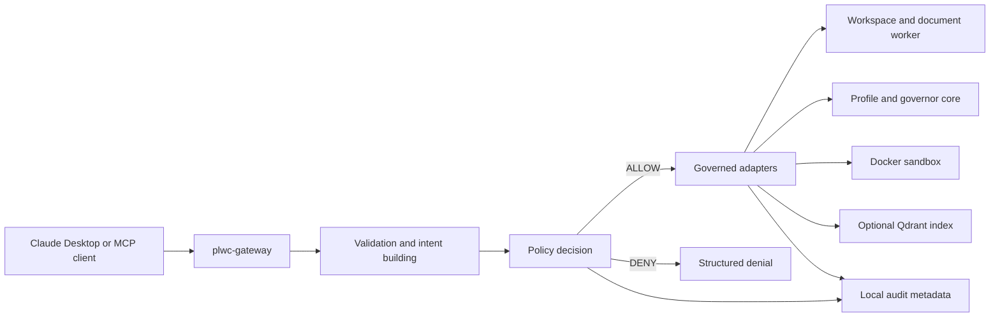

# PLwC Gateway - Program and Software Description

**Open Beta baseline:** `v0.2.0-rc18.dev9`

**Document edition:** English GitHub publication edition

**Last updated:** 2026-07-13

> This document is an English, GitHub-oriented adaptation of the detailed
> German rc18.dev7 program and software description. Version-specific claims
> have been updated against the rc18.dev9 package manifest, runtime source and
> recorded package, Claude Desktop and Odysseus smoke evidence. It is not a
> literal page-by-page translation of the historical document.

## GitHub About Text

```text
Policy-controlled local gateway for Claude Desktop and compatible MCP clients. PLwC exposes one public server and governs workspace, document, sandbox, profile, reflection and memory operations through policy, audit and confirmation gates. Open Beta: v0.2.0-rc18.dev9.
```

## 1. Executive Summary

PLwC, short for **Personality Layer with Conscience**, is a local,
policy-controlled Model Context Protocol (MCP) gateway for Claude Desktop and
compatible MCP clients. It combines governed profile context with bounded local
tool access behind one public server named `plwc-gateway`.

PLwC is designed around a simple rule: **policy before execution**. A model does
not receive raw host-shell access, unrestricted filesystem access or direct
write access to protected profile and governance files. Requests are validated,
translated into explicit intents, checked by policy and only then dispatched to
an approved adapter. Relevant outcomes are recorded as structured local audit
metadata.

The rc18.dev9 Open Beta is intended for power users, writers, developers and
reviewers who want to test local AI-assisted work with explicit boundaries. It
is not a final release, is not production-certified and is distributed as an
unsigned MCPB package.

## 2. Current Open Beta Baseline

| Field | Value |
| --- | --- |
| Package | `plwc-gateway-0.2.0-rc18.dev9.mcpb` |
| Runtime version | `0.2.0rc18.dev9` |
| Public MCP server | `plwc-gateway` |
| Public tool count | 8 |
| Package SHA256 | `2F71AC903BF85CC70023805EC0F901E84C4294982C1B59940350DB3591A2D345` |
| Package smoke | `PASS` |
| Claude Desktop smoke | `PASS` |
| Odysseus MCP smoke | `PASS` |
| Signature | Unsigned |
| Release status | Open Beta, not a final public release |

The package is the approved Open Beta artifact baseline. This does not approve
publishing the private development repository as-is. Public source publication
still requires a separate sanitization and release decision.

## 3. Purpose and Audience

PLwC provides a governed boundary between an MCP client and local capabilities.
Its main goals are:

- keep one inspectable public MCP surface;
- separate model requests from execution policy;
- scope file operations to configured workspace roots;
- protect profile, memory and governance files from ordinary filesystem writes;
- require plan, evidence and confirmation gates for persistent profile changes;
- use isolated Docker execution without silent host-shell fallback;
- make supported operations and denial reasons discoverable at runtime;
- keep high-risk activity locally auditable without logging raw sensitive data.

PLwC is especially relevant when an AI client needs useful local capabilities
but should not be trusted with direct system administration, unrestricted file
access or autonomous long-term memory mutation.

## 4. Architecture and Trust Boundary



The MCP client and model are treated as sources of untrusted input. They may
produce incomplete parameters, unsafe paths or requests that conflict with
governance rules. `plwc-gateway` is the enforcement boundary. Internal adapters
may reuse stable concepts from the profile/governance core and Hardened
Commander, but those source systems are not exposed as independent public MCP
servers.

The intended public state is exactly one visible server:

```text
plwc-gateway
```

Raw or legacy endpoints such as `plfc-mcp`, `pba-mcp`, `desktop-commander` and
`desktop-commander-hardened` must not be enabled as parallel PLwC entry points.
A second filesystem or shell MCP can bypass the PLwC boundary even when PLwC
itself behaves correctly.

## 5. Public MCP Facade

PLwC v0.2 exposes exactly eight public tools. Earlier individual tool names are
not part of the public v0.2 interface; their supported behavior is grouped by
`scope`, `operation` or `lang` parameters.

| Tool | Responsibility |
| --- | --- |
| `plwc_status` | Reports runtime, sandbox, first-run and configuration status. It also exposes the supported Claude Desktop bootstrap route. |
| `plwc_describe` | Returns read-only schemas, operations, required fields, plan types and common denial reasons for the active runtime. |
| `plwc_profile` | Provides governed profile status, snapshots, compile modes, Tagebuch scanning, optional retrieval and read-only CLU Doctor diagnostics. |
| `plwc_reflection` | Writes semantically validated reflection entries using governed marker, trust, evidence, target and candidate fields. |
| `plwc_governor` | Creates plans, applies confirmed plans, reports retirable entries and performs explicit Qdrant reindex or derived-index removal operations. |
| `plwc_sandbox_run` | Runs approved Python, shell or Node.js workloads in isolated Docker images with no host-shell fallback. |
| `plwc_workspace_operation` | Performs bounded list, search, read, write, file-info, batch-read, directory, copy, move, rename, exact-replace and binary operations inside the configured workspace. Delete is not public. |
| `plwc_document_operation` | Creates and inspects Office and PDF artifacts, performs bounded PDF and ZIP operations and reads supported workspace raster images through the governed Document Worker. |

`plwc_describe` is the runtime source of truth for the exact operations and
parameters available in a session. This matters during the Open Beta because
the facade can evolve while the one-server and eight-tool boundary remains
stable.

## 6. Request Lifecycle

A typical request passes through the following stages:

1. The public facade normalizes the requested scope or operation.
2. Required parameters and types are validated before policy evaluation.
3. Paths and profile targets are resolved against configured roots.
4. The gateway builds an explicit intent for the requested action.
5. Policy returns an allow or deny decision with a structured reason.
6. Only an allowed request reaches the relevant adapter.
7. The result is normalized for the MCP client and relevant audit metadata is
   recorded.

Malformed input is distinguished from a policy denial. For example, a missing
required path is reported as parameter validation that was not evaluated by
policy, while parent traversal or a protected-path write is an explicit policy
denial. This distinction prevents a bad tool call from being misread as a
security or environment failure.

## 7. Workspace and Path Security

Workspace operations are restricted to configured roots. PLwC rejects absolute
host paths, parent traversal, UNC-style paths, symlink escapes and protected
profile or governance segments. Conservative user-scoped defaults are used when
custom roots are not configured.

Supported workspace behavior includes bounded reading, writing, searching,
copying, moving, renaming, exact replacement, batch reads and base64 binary
transfer. Destructive file deletion is intentionally outside the public v0.2
workspace contract.

Profile and governance files are not ordinary workspace files. Protected names
include files such as:

- `CORE.md`
- `CONSCIENCE.md`
- `TEMPERAMENT.md`
- `PERSONA.md`
- `memory.md`
- `reflection.md`
- `journal.md`
- active-profile state
- `governance/config.yaml`
- security and policy configuration files

Persistent changes to these areas must use the dedicated profile, reflection or
Governor flows. A normal workspace write cannot be used as a shortcut.

## 8. Document, PDF, ZIP and Image Capabilities

The governed Document Worker supports bounded local artifact operations without
turning the model into a general-purpose desktop automation process.

Current capabilities include:

- DOCX creation with layouts, styles, runs, lists, tables, images and page
  breaks;
- XLSX creation with multiple sheets, formatting, formulas-as-written, freeze
  panes, filters and merged cells;
- PPTX creation with supported layouts, content elements, tables, images,
  slide sizes and plain-text speaker notes;
- PDF creation with supported page sizes, text runs, lists, tables, images and
  explicit page breaks;
- PDF inspection, text extraction, merge, split and rotation;
- ZIP creation, inspection and extraction under bounded size and path rules;
- Office and OpenDocument inspection and extraction;
- governed reads of PNG, JPEG, WEBP and first-frame GIF workspace images as MCP
  image content.

Document assets must be workspace-relative. PLwC does not fetch external image
URLs for document creation. Macro-capable Office generation and macro execution
are not supported.

## 9. Docker Sandbox and Safe Mode

Sandbox execution is Docker-backed. Python and shell snippets run in an
isolated container; Node.js runs a workspace-relative `.js` file in a separate
runner image. Container options, images and mounts are selected by server policy,
not by model-controlled parameters.

The sandbox is designed to use a read-only container root, no runtime network
access, bounded resources, controlled mounts and time limits. If Docker or a
required image is unavailable, PLwC fails closed. It does not silently execute
the request in a host shell.

Safe Mode preserves diagnostic and read-oriented behavior while restricting
mutation-bearing operations. It is a safety posture, not a claim that the host
system itself is fully isolated.

## 10. Profiles, Context and Persona Control

PLwC profiles hold structured identity, working-style, conscience, temperament,
memory and reflection material. Profile compilation produces an explicit,
inspectable context layer for the MCP client rather than silently modifying the
model.

Available compile modes include a compact `boot` mode, task-oriented `working`
mode and broader diagnostic `full` mode. Boot and full compile do not depend on
Qdrant. Working compile may use bounded, fresh semantic-memory retrieval when
Qdrant is explicitly enabled and a suitable task context is supplied.

The persona layer can be disabled globally through the MCPB setting or for one
compile request. When disabled, persona identity and role steering are omitted
from compile output while hard gates, conscience, temperament, profile
resolution, protected boundaries and Governor confirmation rules remain active.

Claude Desktop configuration has explicit active-profile precedence. Creating a
new profile does not falsely report successful activation when the extension is
still configured to select another profile. The response explains the blocker
and requires the configuration to be changed and the Desktop runtime reloaded.

## 11. First Run and Governed Onboarding

The canonical Desktop bootstrap path is discoverable from tool metadata:

1. Discover PLwC with `tool_search("plwc")` when the tools are not immediately
   visible.
2. Call `plwc_status(scope="first_run")`.
3. Review the required onboarding fields and current profile state.
4. Create a profile plan with
   `plwc_governor(operation="plan", plan_type="profile_creation", ...)`.
5. Apply the same governed plan only with explicit confirmation.

Onboarding is all-or-nothing for required structured answers. Unknown or
incomplete fields are not silently written into protected profile files. The
plan phase is non-mutating; the apply phase is the confirmed persistent action.

## 12. Reflection and Governor Flows

`plwc_reflection` records reusable observations rather than arbitrary technical
logs. Inputs are checked for meaningful evidence, destination consistency and
cross-profile write safety. Dev 9 accepts English-first marker and trust inputs,
including practical aliases, while preserving the canonical PBA2 storage values
inside profile files.

The Governor separates analysis from mutation:

- `plan` evaluates evidence, thresholds, conflicts, freshness and the proposed
  target without changing persistent state;
- `apply` requires explicit confirmation and a compatible plan/source state;
- stale or changed evidence requires a new plan;
- insufficient evidence remains blocked even when a caller asks to force the
  operation;
- durable changes to memory, persona or temperament stay within their governed
  target contracts.

This structure is intended to prevent a model from turning a single transient
observation into permanent memory or persona behavior without review.

## 13. Optional Qdrant Retrieval

Qdrant is an optional semantic retrieval index and is off by default. Canonical
memory remains file-based. The index is derived, reconstructable and may be
dropped without deleting canonical profile memory.

PLwC does not automatically reindex during boot, retrieval or compile. Missing,
stale, busy, timed-out or unavailable Qdrant states produce bounded diagnostics
or successful compile fallback behavior instead of making profile compilation
depend on the retrieval backend. Reindexing is an explicit Governor operation.

## 14. CLU Doctor Diagnostics

CLU Doctor is exposed as a read-only mode of `plwc_profile`, not as a separate
public tool or autonomous repair agent. It can report deterministic checks,
findings and items not checked for runtime, smoke and profile scopes.

Doctor may identify inconsistencies, missing evidence or recommended follow-up
actions. It cannot directly modify profile files, run sandbox code, perform
Qdrant maintenance, change policy or apply its own recommendations. Persistent
repairs still require the appropriate governed flow.

## 15. Audit, Privacy and Package Filtering

PLwC records structured local audit metadata for relevant allowed and denied
operations. Audit output is intended to support traceability without copying
complete arguments, file contents or secrets into logs. Sensitive fields and
paths are redacted or summarized according to the operation.

The rc18.dev9 MCPB uses a privacy-filtered package payload. The package excludes
private smoke and release evidence, local profiles, workspaces, logs, tests,
build trees, real security configuration, environment files and nested MCPB
artifacts. The packaged documentation is restricted to a public-safe allowlist.

This filtering applies to the distributed package. It does not by itself make
the complete private development repository suitable for public publication.

## 16. What Changed Since the Dev 7 Description

The detailed rc18.dev7 description remains the structural source for this
document. The rc18.dev9 Open Beta baseline adds or confirms the following
version-specific points:

- `PR-005` privacy-filtered MCPB packaging is part of the beta artifact;
- `RC18-ALIAS-001` provides English-first reflection marker and trust aliases
  while keeping canonical PBA2 storage values;
- the first-run and tool-description bootstrap uses the eight public facade
  tools and `tool_search("plwc")`, not legacy public tool names;
- configured active-profile precedence is reported honestly during profile
  creation and activation;
- the persona layer can be disabled while hard governance remains active;
- the package contains the 512 x 512 PLwC icon and the supported extension
  configuration fields;
- current package, Claude Desktop and Odysseus MCP smoke reports all record
  `PASS` for the rc18.dev9 baseline;
- the beta package has a new SHA256 and remains unsigned.

Historical rc18.dev7 package hashes, file counts and release conclusions must
not be used to verify rc18.dev9.

## 17. Installation and Configuration

The package manifest declares Windows, macOS and Linux support with Python
3.11 or newer. Docker is required for sandbox execution and container-backed
worker capabilities. Actual MCPB installation behavior also depends on the MCP
client and its extension support.

Client paths are intentionally separated:

| Client path | Dev 9 status | Connection |
| --- | --- | --- |
| Claude Desktop | Package and Desktop smoke `PASS` | Install the verified MCPB extension. |
| Local GPT client | Maintainer-confirmed | Extract the verified MCPB and register its bundled `server.py` as one local stdio MCP server. |
| Local Odysseus | Current-package smoke `PASS` | Use the same extracted `plwc-gateway` stdio runtime as an external MCP integration. |
| Hosted ChatGPT web/custom app | Future scope | Requires the planned authenticated HTTPS or Secure MCP Tunnel facade; the MCPB is not uploaded directly. |

The extension exposes configuration fields for:

- workspace and profile roots;
- active profile name;
- optional security configuration;
- memory, persona and temperament evidence thresholds;
- optional Qdrant retrieval;
- default persona-layer disablement.

Install only the announced rc18.dev9 Open Beta package, verify its SHA256 before
installation and ensure that `plwc-gateway` is the only PLwC-related public MCP
server enabled for the test. Local GPT and Odysseus hosts must map command,
arguments and environment settings to the packaged `server.py`; model-controlled
paths or parallel raw filesystem/shell MCP servers are outside the supported
setup.

See [Quickstart for Claude Desktop](QUICKSTART_CLAUDE_DESKTOP.md) and
[Installation](INSTALLATION.md) for the current procedure.

## 18. Known Limitations and Non-Goals

The Open Beta intentionally does not provide:

- OCR;
- PDF redaction or digital signing;
- form creation or form filling;
- PDF/A certification;
- LibreOffice or Pandoc conversion;
- macro execution or macro-enabled Office generation;
- external URL fetching or runtime network access;
- JavaScript inside generated PDFs;
- an HTML/CSS rendering pipeline;
- unrestricted host filesystem or host-shell access;
- autonomous security-policy modification;
- protection for calls that bypass `plwc-gateway`;
- enterprise, stable or production certification.

PLwC is not a backup system, endpoint-security suite or system-wide sandbox. It
governs the operations that actually pass through its public gateway.

## 19. Open Beta Testing and Feedback

Use disposable workspaces and profiles. Do not test with irreplaceable personal
files, private memory content or production data. Confirm the package version,
public server name and tool count before testing mutation-bearing behavior.

Security tests should include expected denials such as parent traversal,
protected-profile writes and incomplete exact-replace requests. A denial is a
successful result when it enforces the documented boundary.

Start with [Open Beta Testing](../BETA_TESTING.md), then follow the
[External Test Plan](EXTERNAL_TEST_PLAN.md). Use one issue per finding and do
not include secrets, real profile content or private local paths in public bug
reports.

## 20. Release Position

The rc18.dev9 MCPB is suitable for Open Beta package distribution with exact
hash verification. It is not approved as a final public release. Remaining
release work includes package signing, a final public tag, explicit release
approval and a separate public-branch sanitization decision for historical and
private-context documentation.

The current security posture favors explicit denial and transparent
limitations over backward compatibility with unsafe legacy behavior.

## 21. License, Contact and Support

PLwC is licensed under the Apache License 2.0. See the repository `LICENSE`
file for the complete terms.

Official project website: [plwc.de](https://plwc.de/)

General contact: [info@plwc.de](mailto:info@plwc.de)

Use [GitHub Issues](https://github.com/mhoedt-ai/PLwC/issues) for reproducible
bugs and feature requests. For security-sensitive reports, contact
[info@plwc.de](mailto:info@plwc.de) privately. Do not include secrets, real
profile content, private paths or other sensitive details in public reports.

Development can be supported voluntarily through Ko-fi:
<https://ko-fi.com/mhoedtai>
